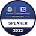
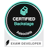
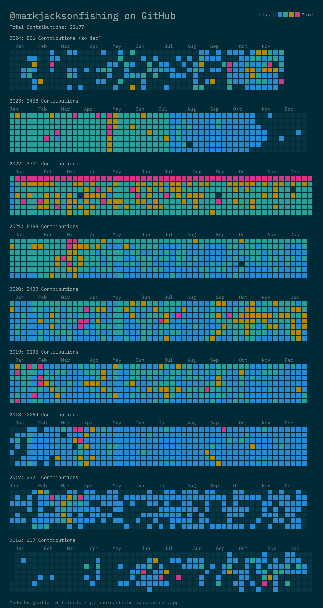
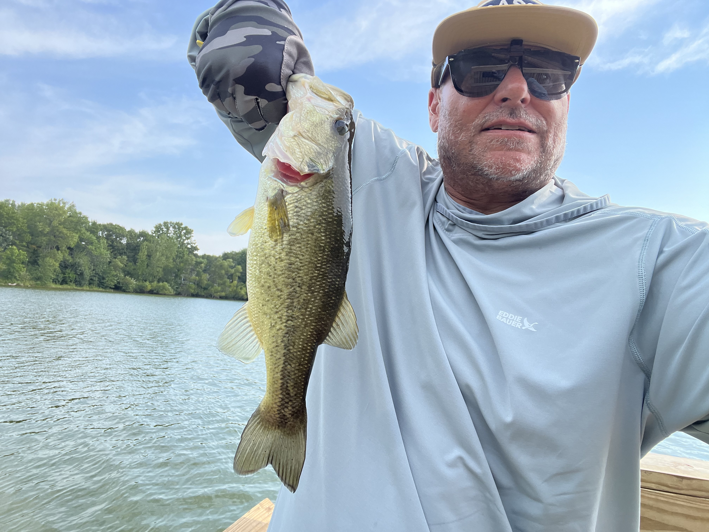

### Security, compliance & AI governance leader

I build security and AI governance programs that make AI systems auditable — where governance evidence is something the system emits, not something a person remembers. Models change, prompts get edited, and new tools get wired in every sprint; governance has to keep pace or it turns into paperwork describing a system that no longer exists.

Underneath that is 20+ years of platform and infrastructure engineering, so I can sit with an auditor in the morning and review an engineer's architecture in the afternoon — and design controls engineers will actually use.

<table>
  <tr>
    <td><strong>Security & Compliance</strong></td>
    <td>
      - SOC 2 Type II program leadership and audit readiness 
      - Third-party penetration testing program and remediation 
      - Vendor and third-party risk, security policy, customer security & AI diligence
    </td>
  </tr>
  <tr>
    <td><strong>AI Governance</strong></td>
    <td>
      - Programs built on the NIST AI RMF: charter, AI inventory, risk tolerance, design-review gates 
      - ISO/IEC 42001 
      - Shadow-AI detection and data-governance controls
    </td>
  </tr>
  <tr>
    <td><strong>Agent Security</strong></td>
    <td>
      - Authorization, containment, observability, and tamper-evident records for autonomous AI systems 
      - Founder, <a href="https://www.anuclei.com">Anuclei</a> — building Multisynapse, a governance, observability, and evaluation platform for AI agents
    </td>
  </tr>
</table>

  <h2>Foundation</h2>
  
  
  
  
  
  
  
  
  
  
  
  

  <h2>Open Source Governance & Leadership</h2>
  
Long before AI governance, I was doing governance in open source.

  <a href="https://www.credly.com/users/marky-jackson" target="_blank">View my Credly profile</a>
  <!-- Badge Images -->
  

    
    
    
    
  

  <!-- Table of Achievements -->
  <table>
    <tr>
      <td><strong>Governance</strong></td>
      <td>
        - Jenkins Governance Board – <a href="https://groups.google.com/g/jenkinsci-dev/c/JusGlXCwbx0/m/2yHT3BFcAAAJ">Details</a> 
        - Kubernetes Release Manager – <a href="https://github.com/markyjackson-taulia/sig-release/blob/master/release-managers.md">Details</a> 
        - Kubernetes Moderator Co-Lead & Org Member – <a href="https://github.com/kubernetes/community/pull/5783#issuecomment-841935980">Details</a>
      </td>
    </tr>
    <tr>
      <td><strong>Mentorship</strong></td>
      <td>
        - Kubernetes Mentoring Lead – <a href="https://github.com/kubernetes/community/blob/master/mentoring/OWNERS#L6">Details</a> 
        - Continuous Delivery Foundation Ambassador 
        - Google Summer of Code Mentor – <a href="https://summerofcode.withgoogle.com/archive/2019/organizations/4658407594786816">Details</a>
      </td>
    </tr>
    <tr>
      <td><strong>Speaking & Writing</strong></td>
      <td>
        - Speaker: KubeCon + CloudNativeCon NA 2022 – <a href="https://www.credly.com/badges/75f117fb-c312-4baf-811a-9be3d5179203/public_url">Credential</a>, cdCon 2022 – <a href="https://www.credly.com/badges/554b47b8-260b-4f25-8392-6825330e7103/public_url">Credential</a>, cdCon 2020 – <a href="https://www.credly.com/badges/b59dd708-ab91-45b9-bed2-c9d3f132efcf/public_url">Credential</a> 
        - Featured by CNCF – <a href="https://www.cncf.io/blog/2020/02/18/why-i-contribute-to-the-open-source-community-and-you-should-too/">Read Article</a> 
        - Talk on AI and ML – <a href="https://www.youtube.com/watch?v=h4hKSXjCqyI">View Talk</a> 
        - MLOps: An Introduction (CD Foundation) – <a href="https://cd.foundation/blog/2020/05/29/mlops-an-introduction/">Read Blog</a> 
        - Writing on agent security and AI governance – <a href="https://www.linkedin.com/in/markjacksonfishing">LinkedIn</a>
      </td>
    </tr>
    <tr>
      <td><strong>Certifications</strong></td>
      <td>
        - Exam Developer: Certified Backstage Associate – <a href="https://www.credly.com/badges/1b5a6de3-e6d9-452b-8752-ff8687a94d3a">View Certification</a>
      </td>
    </tr>
    <tr>
      <td><strong>Awards</strong></td>
      <td>
        - Most Valuable Jenkins Advocate – <a href="https://www.businesswire.com/news/home/20200924005128/en/DevOps-World-2020-Award-Winners-Announced">Details</a> 
        - Kubernetes ContribEx Contributor Award – <a href="https://www.kubernetes.dev/community/awards/2022/#contributor-experience">Details</a>
      </td>
    </tr>
  </table>

#### Background

Previously at Yahoo!, Symantec, HP, AT&T Labs, Sysdig, Equinix Metal (formerly Packet), Hightail (formerly YouSendIt), Blue Cross of California, and Jasmine Multimedia. BA and master's degree from MIT. U.S. Army veteran, with service in Iraq and Afghanistan.

  <h2>All-Time GitHub Contributions</h2>
  
  
Total Contributions: <b>22,677</b>

#### Off the Clock

Bass angler (<a href="https://www.bassfinity.com">Bassfinity</a>), home cook — I've contributed recipes to the [cloud-native community cookbook](https://github.com/cncf/cloud-native-community-cookbook) — and SF Giants fan.

